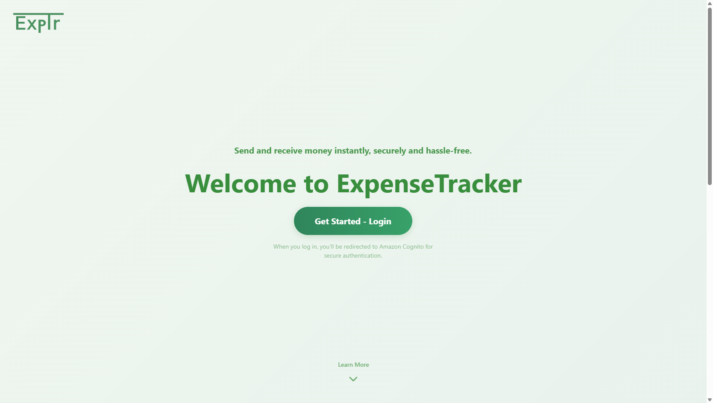
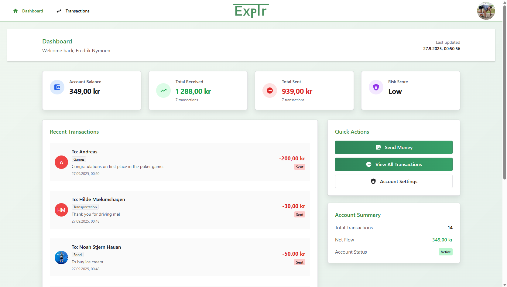
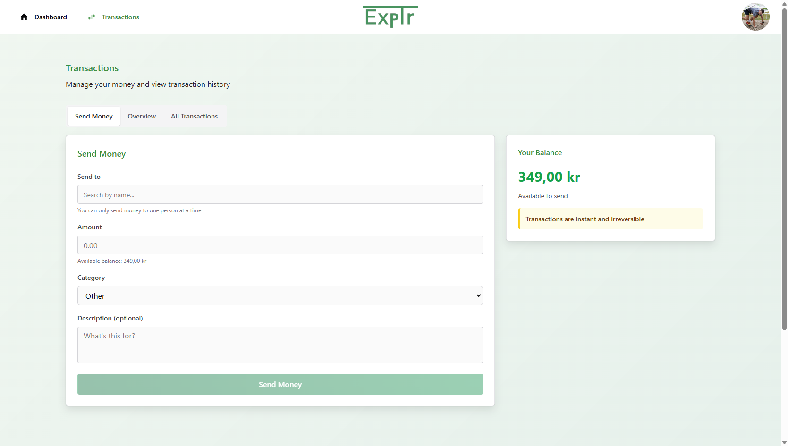
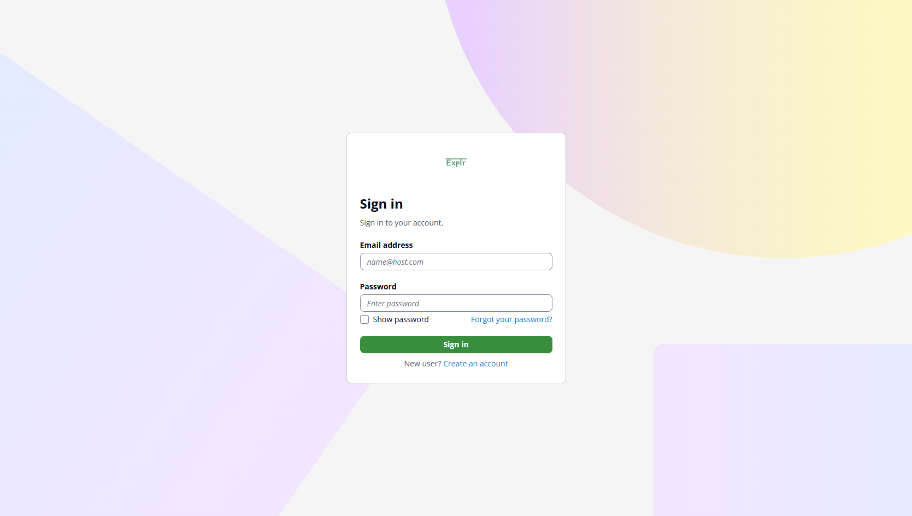
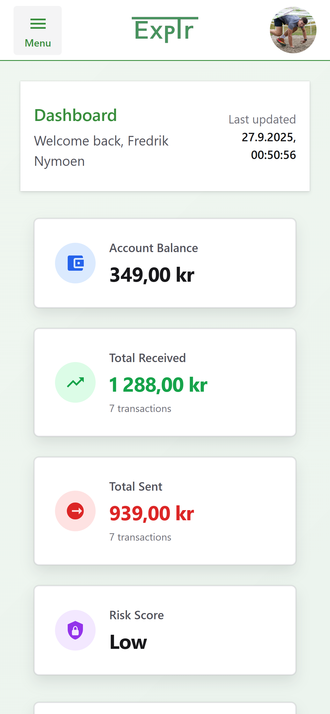

# ExpenseTracker

A modern expense tracking application built with React, Node.js, Express and Neo4j that allows users to manage their personal finances in a secure and user-friendly way. Hosted on AWS.

🌐 **Live Demo**: [https://d2m47o9qwrddqu.cloudfront.net/](https://d2m47o9qwrddqu.cloudfront.net)

## 🎯 Features

- **User Authentication**: Secure login with AWS Cognito
- **Dashboard**: Overview of financial status and transactions
- **Transaction Management**: Add and view transactions
- **User Profile**: Manage account settings and personal information
- **Daily Bonus**: Reward system for users
- **Suspicious Behavior Analysis**: Monitor and analyze user behavior patterns for security
- **Responsive Design**: Works on desktop and mobile devices

## 📸 Screenshots

### Landing Page

*Welcome page with application overview and login options*

### Dashboard

*Main dashboard showing expense overview, recent transactions, and financial summary*

### Transaction Management

*Able to send money, see data of the transactions, and see all transactions*

### Login Page

*Secure authentication interface powered by AWS Cognito*

### Mobile Responsive Design


*Responsive design working seamlessly across all device sizes*

## 🛠️ Technology Stack

### Frontend
- **React 19** with TypeScript
- **Chakra UI** for UI components
- **Vite** as build tool
- **React Router DOM** for navigation
- **OIDC Client** for authentication

### Backend
- **Node.js** with Express.js
- **Neo4j** database
- **AWS Cognito** for user authentication
- **AWS Lambda** for serverless deployment

### AWS Services
- **AWS Lambda** - Serverless backend functions
- **AWS API Gateway** - REST API management
- **AWS S3** - Static file storage
- **AWS CloudFront** - Content delivery network
- **AWS Cognito** - User authentication and authorization

### Deployment
- **Serverless Framework** for deployment orchestration

## 📦 Project Structure

```
ExpenseTracker/
├── frontend/                 # React frontend application
│   ├── src/
│   │   ├── components/      # Reusable components
│   │   ├── pages/          # Application pages
│   │   ├── contexts/       # React contexts
│   │   ├── hooks/          # Custom hooks
│   │   └── utils/          # Helper functions
│   ├── dist/               # Built frontend
│   └── package.json
├── backend/                 # Node.js backend API
│   ├── controllers/        # API controllers
│   ├── routes/            # API routes
│   ├── middleware/        # Middleware functions
│   ├── services/          # Services (Cognito, etc.)
│   ├── config/            # Configuration files
│   └── utils/             # Backend helper functions
├── screenshots/             # Application screenshots
├── serverless.yml          # Serverless configuration template
└── package.json           # Root project dependencies
```

## 🚀 Getting Started

### Prerequisites

- Node.js (version 18 or newer)
- npm or yarn
- AWS account (for deployment)
- Neo4j database (cloud or local)

### Installation

1. **Clone the repository**
   ```bash
   git clone https://github.com/FredrikNymoen/ExpenseTracker.git
   cd ExpenseTracker
   ```

2. **Install dependencies**
   ```bash
   npm install
   npm install --prefix frontend
   ```

3. **Set up environment variables**

   Create `.env` file in root directory:
   ```env
   NEO4J_URI=your_neo4j_uri
   NEO4J_USERNAME=your_username
   NEO4J_PASSWORD=your_password
   COGNITO_REGION=your_cognito_region
   COGNITO_USER_POOL_ID=your_user_pool_id
   ```

   Create `.env` file in `frontend/` directory:
   ```env
   VITE_API_URL=http://localhost:3000/api
   VITE_COGNITO_DOMAIN=your_cognito_domain
   VITE_COGNITO_CLIENT_ID=your_client_id
   VITE_COGNITO_REDIRECT_URI=http://localhost:5173/callback
   ```

### Development

1. **Start the backend server**
   ```bash
   npm run dev
   ```

2. **Start the frontend development server**
   ```bash
   cd frontend
   npm run dev
   ```

3. **Open the application**
   Navigate to `http://localhost:5173` in your browser

### Building for Production

```bash
npm run build
```

## 🚀 Deployment

The application is configured for deployment on AWS using the Serverless Framework.

### AWS Deployment

1. **Install Serverless CLI**
   ```bash
   npm install -g serverless
   ```

2. **Configure AWS credentials**
   ```bash
   aws configure
   ```

3. **Deploy the application**
   ```bash
   npx serverless deploy
   ```

### Deployment URLs

- **Frontend**: Hosted on AWS CloudFront with S3 backend
- **Backend API**: Available via AWS API Gateway and Lambda

## 📋 API Endpoints

### User API
- `GET /api/me` - Get current user information
- `PUT /api/me/profile` - Update user profile
- `POST /api/me/bonus` - Get daily bonus

### Transaction API
- `GET /api/transactions` - Get all transactions
- `POST /api/transactions` - Create new transaction
- `PUT /api/transactions/:id` - Update transaction
- `DELETE /api/transactions/:id` - Delete transaction

### Administration API
- `GET /api/users` - Get all users (admin)
- `DELETE /api/users/:id` - Delete user (admin)

## 🔐 Security

- JWT tokens for authentication
- AWS Cognito for user registration and login
- CORS configuration for secure API access
- Environment variables for sensitive data
- Suspicious behavior analysis and monitoring

## 🧪 Testing

```bash
# Run linting
npm run lint --prefix frontend

# Build project to check for errors
npm run build
```
